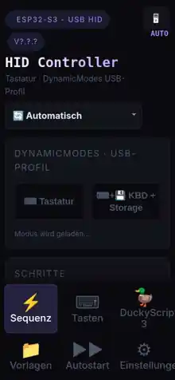

# ESP32-S3 USB HID Keyboard Controller

> WLAN-gesteuerter USB-HID-/Storage-Controller für den ESP32-S3 mit responsivem Webinterface, Sequenz-Builder, Vorlagen, OS-Erkennung, Autostart, DuckyScript-Import und OTA.

**Aktuelle Firmware:** `v1.13.10` · `2026-08-19`  
**Referenz-Hardware:** Waveshare ESP32-S3-Zero  
**Arduino-ESP32 Core:** `3.3.11` empfohlen (für den erweiterten passiven Host-Fingerprint exakt erforderlich)

[Installation](INSTALL.md) · [Schnellstart](QUICKSTART.md) · [Changelog](CHANGELOG.md)

## Webinterface

### Desktop


### Mobile



Das Webinterface ist direkt in der Firmware gzip-komprimiert eingebettet; die Abbildungen oben wurden aus der aktuellen v1.13.10-HTML-Oberfläche gerendert.

## Highlights

- **USB DynamicModes:** Umschaltbares Profil `Tastatur` oder `Tastatur + Storage` ohne neues Flashen.
- **Sequenz-Builder:** Text, Taste/Kombination, Pause, USB-Wartezustand, Lock-LED-Wartezustand und Phase.
- **DE-QWERTZ HID-Mapping:** Umlaute, Sonderzeichen, AltGr-Zeichen und Windows-Taste (`Win`) werden gezielt abgebildet.
- **Per-Step-Geschwindigkeit:** Textschritte können die globale Tippgeschwindigkeit überschreiben.
- **Vorlagen:** Persistente, OS-spezifische Vorlagen in LittleFS mit Backup/Migration.
- **Autostart:** Ordner mit Windows/Linux/macOS-Varianten; Auto- oder manuelle OS-Auswahl, Fallback und Wiederholung.
- **Passive Host-OS-Erkennung:** Windows/Linux/macOS anhand mehrerer USB-Fingerprints; starke Methoden u. a. A, L4 und M4.
- **Session-OS-Modus:** `Automatisch`, `Windows`, `Linux`, `macOS`, `Allround`; manuelle Wahl gilt nur bis zum Neustart.
- **DuckyScript 3 Import:** Datei/Editor, Funktionsimport, Zielsystem und Kompatibilitätsmodi.
- **Arduino-.INO-Import:** Erkennbare Tastaturabläufe aus `.ino`, `.cpp`, `.h` und Text übernehmen.
- **Virtuelle QWERTZ-Tastatur:** Touch-optimiert für Desktop, Tablet und Smartphone.
- **Responsive UI:** Automatisches Desktop/Mobile-Layout, manueller Layout-Umschalter, Bottom-Navigation und Safe-Area-Support.
- **OTA:** Firmware-Update direkt über den Browser.
- **WLAN + Fallback-AP + mDNS:** Konfiguration über Webinterface; Fallback-Hotspot bei fehlender Verbindung.

## Hardware

| Komponente | Empfehlung |
|---|---|
| Mikrocontroller | **Waveshare ESP32-S3-Zero** oder kompatibler ESP32-S3 mit nativem USB-OTG |
| USB | Native USB-OTG/HID-Verbindung zum Zielgerät |
| WLAN | 2,4 GHz Wi-Fi |
| Flash | 8 MB empfohlen |
| Dateisystem | LittleFS-Bereich für Vorlagen |

## Installation in Kurzform

1. Arduino IDE 2.x installieren.
2. **ESP32 by Espressif Systems 3.3.11** installieren.
3. Für die vollständige automatische OS-Erkennung unter Windows den mitgelieferten Core-Patch ausführen:

```powershell
powershell -ExecutionPolicy Bypass -File .\install_passive_host_fingerprint_core_3_3_11.ps1
```

4. Boardoptionen setzen:

```text
Board:                    ESP32S3 Dev Module
USB Mode:                 USB-OTG (TinyUSB)
USB CDC On Boot:          Disabled
USB Firmware MSC On Boot: Disabled
USB DFU On Boot:          Disabled
Flash Size:               8MB
Partition Scheme:         OTA-fähig + nutzbarer LittleFS-Bereich
```

5. `keyboard_controller.ino` öffnen, kompilieren und hochladen.

Die vollständige Anleitung inklusive Core-Patch, Backup/Restore, WLAN-Erststart und OTA steht in **[INSTALL.md](INSTALL.md)**.

> **Wichtig:** Die Firmware enthält Compile-Guards für die USB-Optionen. Werden CDC/MSC/DFU vom Board-Menü zusätzlich aktiviert, bricht der Build absichtlich mit einer verständlichen Fehlermeldung ab.

## Erster Start

Kann keine gespeicherte WLAN-Verbindung hergestellt werden, startet der Controller einen Fallback-Access-Point. Die aktuell in der Firmware konfigurierte SSID/Adresse wird im seriellen Log bzw. auf der Weboberfläche angezeigt. Nach dem Speichern der WLAN-Zugangsdaten verbindet sich der ESP32 mit dem Heimnetz; mDNS ist zusätzlich unter `esp32-keyboard.local` vorgesehen.

## Sequenz-Schritte

| Typ | Funktion |
|---|---|
| **Text** | Text als HID-Tastatureingabe senden; optional eigene Geschwindigkeit |
| **Taste** | Einzeltaste oder Kombination, z. B. `Win`, `Win + R`, `Ctrl + C`, `ENTER` |
| **Pause** | Feste Wartezeit in Millisekunden |
| **Warten auf USB-Zustand** | Auf USB bereit/suspendiert/getrennt warten; optional mit Timeout |
| **Warten auf Lock-LED** | Auf Caps/Num/Scroll-Lock-Zustand des Hosts warten |
| **Phase** | Benannte Ablaufphase für Status/Diagnose setzen |

Bei `Warten auf USB-Zustand` bedeutet Timeout `0`, dass unbegrenzt gewartet wird. Ein nachfolgender Text-/Tastenschritt benötigt wieder einen bereiten USB-Host.

## HID Controller: OS-Modus

Der Modus oben auf der Startseite steuert die OS-Bedingungen der laufenden Session:

| Modus | Verhalten |
|---|---|
| `🔄 Automatisch` | Passive USB-Erkennung bestimmt das effektive OS |
| `🖥 Windows` | OS-Bedingungen werden als Windows ausgewertet |
| `🐧 Linux` | OS-Bedingungen werden als Linux ausgewertet |
| `🍎 macOS` | OS-Bedingungen werden als macOS ausgewertet |
| `🌐 Allround` | OS-Filter werden vollständig umgangen |

Die manuelle Auswahl wird **nicht** in NVS gespeichert. Nach jedem ESP32-Neustart startet die Session wieder mit `Automatisch`.

## Passive Host-Erkennung

Die Firmware aggregiert mehrere USB-Beobachtungen. Starke Signale sind insbesondere:

- **A:** Microsoft-OS-Descriptor/Control-Request-Pfad → starkes Windows-Signal
- **L4:** passiver Linux-Fingerprint
- **M4:** passiver macOS-Fingerprint

Der mitgelieferte `install_passive_host_fingerprint_core_3_3_11.ps1` erweitert den Arduino-ESP32-Core 3.3.11 um die benötigten TinyUSB-Beobachtungshooks. Ohne Patch bleibt die Firmware buildbar, die entsprechenden Methoden werden jedoch als nicht verfügbar angezeigt.

## Autostart

Autostart arbeitet mit Vorlagenordnern und OS-Varianten:

- **Auto:** alle vorhandenen OS-Sequenzen des Ordners sind potenziell aktiv; die aktuell erkannte Variante wird separat markiert.
- **Manuell:** nur die fest ausgewählte OS-Variante ist aktiv.
- Erneutes Anklicken einer bereits aktiven Auswahl hebt sie wieder auf.
- Optionaler Fallback kann verwendet werden, wenn die automatisch erkannte OS-Variante im Ordner fehlt.
- Bei unbekanntem OS startet Auto nicht blind eine falsche Plattformsequenz.

## Mobile Oberfläche

Die Oberfläche verwendet native CSS-Viewportbreite und wechselt abhängig von Breite/Orientierung automatisch zwischen Desktop und Mobile. Zusätzlich kann das Layout manuell umgeschaltet werden.

Mobile Besonderheiten:

- große Touchflächen und Eingabefelder ohne Fokus-Autozoom,
- Bottom-Navigation mit Safe-Area-Abstand,
- vertikales Momentum-Scrolling,
- kein horizontaler Seiten-Scroll,
- interner Scrollbereich für lange Listen/Logs,
- „Nach oben“-Button auf langen Seiten,
- aufklappbare Karten und reduzierte Detailbereiche.

## Datenspeicherung

| Daten | Speicherort |
|---|---|
| Vorlagen | LittleFS (`/templates.json`, temporäre/Backup-Dateien) |
| WLAN | NVS / Preferences |
| Autostart-Konfiguration | NVS / Preferences |
| Session-OS-Modus | RAM, absichtlich **nicht** persistent |
| Aktuelle UI-/Builder-Zustände | Browser/Frontend, je nach Funktion LocalStorage |
| Firmware | ESP32 Flash / OTA-Partition |

## OTA

Eine mit der Arduino IDE exportierte `.bin` kann über die OTA-Seite des Controllers installiert werden. Nach erfolgreichem Flash startet der ESP32 neu.

## Projektdateien

```text
keyboard_controller.ino
install_passive_host_fingerprint_core_3_3_11.ps1
README.md
INSTALL.md
QUICKSTART.md
CHANGELOG.md
docs/images/
  webinterface-desktop.webp
  webinterface-mobile.webp
```

## Hinweise

Dieses Projekt emuliert USB-HID-Eingaben. Verwende es ausschließlich an Systemen, an denen du zur Automatisierung und Eingabe berechtigt bist. OS-Fingerprints sind heuristische Signale; die Firmware behandelt schwache Methoden deshalb nicht als alleinige OS-Entscheidung.

## Lizenz

Siehe [`LICENSE`](LICENSE).
